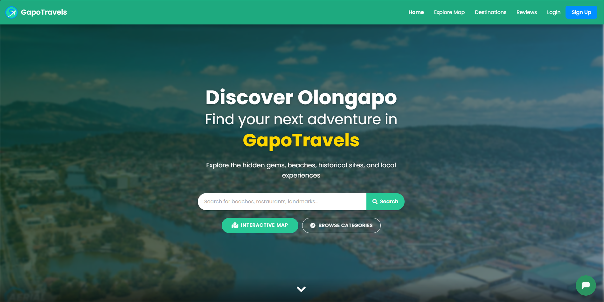

# GapoTravels - Olongapo City Travel Guide

A web application that helps users discover and explore destinations in Olongapo City, featuring interactive maps, reviews, and local recommendations.

## UI Preview

### Desktop View

*The desktop interface showing the home page with search functionality and navigation menu*

### Mobile View


*The responsive mobile interface with optimized navigation and search*

## Features

### User Authentication & Profiles
- Email-based registration and login
- Customizable user profiles with compressed image uploads
- Secure password handling and email verification

### Destination Management
- Interactive map with location markers
- Categorized destinations:
  - Beaches & Waterfront
  - Nature & Parks
  - Historical Sites
  - Food & Dining
  - Shopping Centers
  - Nightlife & Entertainment

### Reviews & Ratings
- User reviews with 5-star rating system
- Photo upload capability
- Review moderation system
- Real-time review updates

### Image Processing
- Automatic image compression and optimization
- Profile picture resizing (max 800x800)
- Format standardization to JPEG
- Storage optimization for Supabase

### Interactive Features
- Dynamic search functionality
- Location-based filtering
- Interactive map navigation
- Mobile-responsive design

## Tech Stack

### Frontend
- HTML5, CSS3, JavaScript
- Bootstrap 5.1.3
- Font Awesome 5.15.4
- Leaflet.js (Interactive Maps)

### Backend
- Python 3.13.1
- Flask 3.0.2
- Supabase (Database & Storage)
- Flask-Login (Authentication)
- Pillow (Image Processing)

## Installation

1. Clone the repository
```bash
git clone https://github.com/Ryllepv/GapoTravels.git
cd GapoTravels
```

2. Create and activate virtual environment
```bash
python -m venv .venv
# On Windows:
.venv\Scripts\activate
# On Unix/MacOS:
source .venv/bin/activate
```

3. Install dependencies
```bash
pip install -r requirements.txt
```

4. Set up environment variables
Create a `.env` file with:
```env
SUPABASE_URL=your_supabase_url
SUPABASE_KEY=your_supabase_key
SUPABASE_SERVICE_ROLE_KEY=your_service_role_key
FLASK_SECRET_KEY=your_secret_key
```

5. Run the application
```bash
python app.py
```

The application will be available at `http://localhost:5000`

## Project Structure
```
GapoTravels/
├── static/
│   ├── images/      # Static images
│   ├── uploads/     # User uploaded content
│   └── style.css    # Main stylesheet
├── templates/       # HTML templates
│   ├── base.html    # Base template
│   ├── index.html   # Homepage
│   ├── login.html   # Authentication
│   ├── signup.html  # User registration
│   └── ...         # Other templates
├── .env            # Environment variables
├── app.py          # Main application file
└── requirements.txt # Python dependencies
```

## Dependencies
- Flask==3.0.2
- python-dotenv==1.0.1
- supabase==2.3.4
- Werkzeug==3.0.1
- bcrypt==4.1.2
- Flask-Login==0.6.3
- requests==2.31.0
- python-dateutil==2.8.2
- Pillow==10.4.0

## Features in Detail

### Image Processing
The application automatically processes uploaded images:
- Resizes large images to max 800x800 pixels
- Converts all images to JPEG format
- Compresses images while maintaining quality
- Optimizes for web display and storage

### Authentication System
- Email/Password authentication
- Password hashing with bcrypt
- Session management with Flask-Login

### Interactive Map
- Built with Leaflet.js
- Custom markers for different location types
- Pop-up information windows
- Location clustering for better performance

## Contributing
1. Fork the repository
2. Create your feature branch (`git checkout -b feature/AmazingFeature`)
3. Commit your changes (`git commit -m 'Add some AmazingFeature'`)
4. Push to the branch (`git push origin feature/AmazingFeature`)
5. Open a Pull Request

## License
This project is licensed under the MIT License - see the [LICENSE](LICENSE) file for details.

## Contact
- Email: contact@gapotravels.com
- Website: https://gapotravels.com
- Phone: +63 912 911 7890
